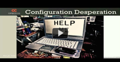

Home
====

  

Welcome to the Chef Wiki!
=========================

### Chef is a systems integration framework, built to bring the benefits of configuration management to your entire infrastructure.

  

#### With Chef, you can:

-   Manage your servers by writing code, not by running commands. (via
    [Cookbooks](Cookbooks.html "Cookbooks"))
-   Integrate tightly with your applications, databases, LDAP
    directories, and more. (via [Libraries](Libraries.html "Libraries"))
-   Easily configure applications that require knowledge about your
    entire infrastructure ("What systems are running my application?"
    "What is the current master database server?") (via
    [Search](Search.html "Search"))
-   Create perfect clones of QA environments, pre-production
    environments, partner preview environments and more. (via
    [Environments](Environments.html "Environments"))

Once automated, you hold a blueprint for your infrastructure, enabling
you to build, or rebuild, automatically in minutes or hours – not weeks
or months. Better still, when you take those environments live and
reality intrudes - which, trust us, it will - Chef gives you endless
flexibility to adapt on the fly.

#### It works the way you want it to:

We provide the building blocks that help you to accomplish your goals.
At the end of the day, it's about your infrastructure being easy to
manage. Chef provides the horse-power to get you to where you need to be
- it doesn't start out telling you where you should be going.   

**The open-source systems integration framework built specifically for
automating the cloud**

**Some central concepts for obtaining configuration management benefits
in your infrastructure**

-   **Tell me why!** **[Should I use Chef?](7274864.html "Why Chef?")**
-   [What is Chef](About.html "About") anyway?
-   What are [Chef's core
    principles](Chef%20Core%20Principles.html "Chef Core Principles")?
-   How many [types of
    Chef](The%20Different%20Flavors%20of%20Chef.html "The Different Flavors of Chef")
    are there?
-   How is it [licensed and why](FAQ.html "FAQ")?

-   **New to Chef?** **[Start Here!](Chef%20Basics.html "Chef Basics")**
-   Includes an [Architecture
    Introduction](Architecture%20Introduction.html "Architecture Introduction"),
-   an overview of the Chef [concepts and
    terminology](Core%20Components.html "Core Components"),
-   an [Introduction to cookbooks, recipes, resources, and
    roles](Introduction%20to%20Cookbooks%20and%20More.html "Introduction to Cookbooks and More"),
    and
-   an [Introduction to Search and Data
    Bags](Introduction%20to%20Search%20and%20Data%20Bags.html "Introduction to Search and Data Bags")

**There are several clients for interacting with a Chef Server, Hosted
or Private Chef, or Chef Solo**

**Understand these essential components for utilizing the full
capability and power of Chef**

-   **How does Chef run?** **[Understand the
    architecture](Architecture.html "Architecture")**
-   Understand the [authentication and
    authorization](Authentication%20and%20Authorization.html "Authentication and Authorization")
    models applied,
-   the [anatomy of a chef-client
    run](Anatomy%20of%20a%20Chef%20Run.html "Anatomy of a Chef Run")
    within the architecture,
-   architectural components the [Chef
    Client](Chef%20Client.html "Chef Client"), [Chef
    Server](Chef%20Server.html "Chef Server"), and [Chef
    Solo](Chef%20Solo.html "Chef Solo"),
-   interaction with the [REST API](Server%20API.html "Server API") and
    [more](Architecture.html "Architecture").

-   **Ready for more in-depth information?** **[Dive into
    Details](Chef%20Essentials.html "Chef Essentials")**
-   An in depth exploration of all the features and functions of Chef
-   Explore [Cookbooks](Cookbooks.html "Cookbooks") more fully
-   Reach into [Attributes](Attributes.html "Attributes"),
    [Definitions](Definitions.html "Definitions"),
    [Environments](Environments.html "Environments"), [Exception and
    Report
    Handlers](Exception%20and%20Report%20Handlers.html "Exception and Report Handlers"),
    [Resources](Resources.html "Resources"),
    [Roles](Roles.html "Roles"), [Ohai](Ohai.html "Ohai"), and
    [more](Chef%20Essentials.html "Chef Essentials").

**No matter the complexity of your business, Chef makes it easy to
deploy servers and scale applications across infrastructure**

**Manage your infrastructure via command line, a WebUI, an irb session,
and through adding plugins for additional functionality**

-   **Ready to start automating?** **[Install
    Chef!](Installation.html "Installation")**
-   Set up your [Chef
    Workstation](Workstation%20Setup.html "Workstation Setup"),
-   OS specific installation instructions for [Installing Chef Client
    and Chef
    Solo](Installing%20Chef%20Client%20and%20Chef%20Solo.html "Installing Chef Client and Chef Solo"),
    or [Installing the Open Source Chef
    Server](Installing%20Chef%20Server.html "Installing Chef Server").
-   [Upgrade
    Instructions](Upgrade%20Instructions.html "Upgrade Instructions")
-   Use of [Vagrant](Vagrant.html "Vagrant") for building and
    distributing virtualized development environments.

-   **Manage your Infrastructure:** **[With
    Chef](Managing%20Chef.html "Managing Chef")**
-   Use of [Knife](Knife.html "Knife") - the powerful Chef command line
    utility to [bootstrap new
    nodes](Knife%20Bootstrap.html "Knife Bootstrap"), [launch cloud
    instances](Launch%20Cloud%20Instances%20with%20Knife.html "Launch Cloud Instances with Knife")
    and more.
-   The [Management
    Console](Management%20Console.html "Management Console") WebUI
    Interface,
-   Use of [Shef](Shef.html "Shef") for running in an irb session,
-   [Community Plugins](Community%20Plugins.html "Community Plugins") to
    extend Chef, Ohai and Knife,
    [Spiceweasel](Spiceweasel.html "Spiceweasel") for batch-loading, and
    [more](Managing%20Chef.html "Managing Chef").

**Reference documentation and related information - Read up here!**

**Walkthrough Guides, Webcasts, Tutorials, Training - Learn here!**

-   **Want to broaden your understanding?** **[Read
    up!](Documentation.html "Documentation")**
-   [A Can of Condensed Chef
    Documentation](A%20Can%20of%20Condensed%20Chef%20Documentation.html "A Can of Condensed Chef Documentation")
    with a [Glossary](Glossary.html "Glossary") of terms, technologies
    and concepts.
-   Reference material on the [Chef Configuration
    Settings](Chef%20Configuration%20Settings.html "Chef Configuration Settings")
    and [Just Enough Ruby for
    Chef](Just%20Enough%20Ruby%20for%20Chef.html "Just Enough Ruby for Chef"),
    along with [Chef OmniGraffle & Visio
    Stencils](11141359.html "Chef OmniGraffle & Visio Stencils").
-   [Release Notes](Release%20Notes.html "Release Notes") for each
    version
-   All the Getting Started Docs, [community member books and reference
    cards](Documentation.html "Documentation"), and more.

-   **Seeking Instruction?** **[Learn Here!](Guides.html "Guides")**
-   [Walkthrough guides and webcasts](Guides.html "Guides") to go step
    by step through installing 6 common server stacks including a [rails
    stack](http://wiki.opscode.com/display/chef/Build+A+Rails+Stack), a
    [java web
    stack](http://wiki.opscode.com/display/chef/Build+A+Java+Web+Stack),
    and [others](Guides.html "Guides").
-   “How To Guides” including a [Guide to Creating A Cookbook and
    Writing A
    Recipe](Guide%20to%20Creating%20A%20Cookbook%20and%20Writing%20A%20Recipe.html "Guide to Creating A Cookbook and Writing A Recipe"),
    [Deploying OpenStack with
    Chef](Deploying%20OpenStack%20with%20Chef.html "Deploying OpenStack with Chef")
    and [more](Guides.html "Guides").
-   Multiple excellent tutorials put together by Chef community members,
    and
-   Access to [training courses and materials](Guides.html "Guides").

**The Chef Open Source Community - Join and Contribute here!**

**Need assistance? You have support!**

-   **Want to Contribute?** **[Join the
    Community!](Developers.html "Developers")**
-   When you use Chef, you join [a vibrant community of
    professionals](Developers.html "Developers").
-   Here you'll find [How to
    Contribute](How%20to%20Contribute.html "How to Contribute") and
    [Approved
    Contributors](Approved%20Contributors.html "Approved Contributors").
-   The [Release MVPs](Release%20MVPs.html "Release MVPs") from the
    Community,
-   The [Release Process](Release%20Process.html "Release Process") for
    Opscode Open Source Projects.
-   [Feature Proposals](Feature%20Proposals.html "Feature Proposals")
    that are larger than a more standard request, and more.

**Gather with fellow Chefs and others facing similar challenges - come
to a Community Event!**

  
 Official [Community
Events](Community%20Events.html "Community Events"), including:
**[FoodFight](Community%20Events.html "Community Events")** - a
bi-weekly Chef Community Podcast, Opscode Events, MeetUps and
Conferences we're attending, and the inaugural [Opscode Community Summit
1](Opscode%20Community%20Summit%201.html "Opscode Community Summit 1")
plus **[\#chefconf](Community%20Events.html "Community Events")**: the
Chef User Conference.

-   **Seeking Help?** **[You have Support!](Support.html "Support")**
-   [Support](Support.html "Support") resources for all Chef users -
    including:
    -   [Common Errors](Common%20Errors.html "Common Errors"), and
    -   a [Troubleshooting and Technical
        FAQ](Troubleshooting%20and%20Technical%20FAQ.html "Troubleshooting and Technical FAQ").

-   Real-time interactive community support from [IRC](IRC.html "IRC"),
    with [IRC logs](http://likens.us/logs/) to review previous
    discussions.
-   You can sign up for [Chef Mailing Lists](http://lists.opscode.com/)
-   File an [Open Source Ticket](http://tickets.opscode.com)
-   You can also follow us on Twitter through
    [@opscode](http://twitter.com/opscode)
-   The [Opscode Blog](http://www.opscode.com/blog) is updated regularly
    with company and product information, and has an [RSS
    feed](http://www.opscode.com/blog/feed/) for your convenience.

***Hosted and Private Chef users can also receive support by
contacting***
***[support@opscode.com](mailto:support@opscode.com)******.***

-   Periodic maintenance is announced in advance via the [Opscode Status
    site](http://status.opscode.com/), as are any emergent issues with
    availability.
-   Sign up for [@opscode\_status](http://twitter.com/opscode_status)
    for timely notice of any information on Hosted Chef availability and
    performance.

  
  
  
  

  
  

  

**Quick Links**

-   [Installation](Installation.html "Installation")
-   [Walkthrough Guides and Tutorials](Guides.html "Guides")
-   [Chef Wiki As A PDF](Documentation.html "Documentation")
-   [How to Contribute](How%20to%20Contribute.html "How to Contribute")
-   [Source Code](http://github.com/opscode/chef)
-   [Open Source Ticket
    Tracking](http://tickets.opscode.com/browse/CHEF)
-   [Just Enough Ruby for
    Chef](Just%20Enough%20Ruby%20for%20Chef.html "Just Enough Ruby for Chef")
-   [Troubleshooting and Technical
    FAQ](Troubleshooting%20and%20Technical%20FAQ.html "Troubleshooting and Technical FAQ")
-   [Resource Reference](Resources.html "Resources")
-   [Support](Support.html "Support")

  

##### 

Why Chef?

**[Watch a short video about Opscode Chef & Cloud Infrastructure
Automation](http://www.youtube.com/watch?v=UpHKVkLDBtU)**

  

  

##### 

Looking For Instant Gratification?

The **[Fast Start Guide](Fast%20Start%20Guide.html "Fast Start Guide")**
will get you up and running quickly on Ubuntu or Mac OS X using Hosted
Chef (as your chef server).

If you prefer to install your own server, use the Chef Server + Chef
client directions at [Installation](Installation.html "Installation").
  

  

  

  

#### Opscode.com Blog

  --------------------------------------------------------------------------------------------------------------------------------------------------------
  **[Opscode Joins Google Cloud Platform Partner Program](http://www.opscode.com/blog/2012/07/24/opscode-joins-google-cloud-platform-partner-program/)**
  **[On the level: Testing your infrastructure](http://www.opscode.com/blog/2012/07/20/on-the-level-testing-your-infrastructure/)**
  **[Omnibus Chef Packaging](http://www.opscode.com/blog/2012/06/29/omnibus-chef-packaging/)**
  **[Rule the Cloud – Now w/Google, too.](http://www.opscode.com/blog/2012/06/28/rule-the-cloud-heres-how/)**
  **[Chef for OpenStack](http://www.opscode.com/blog/2012/06/27/chef-for-openstack/)**
  **[Chef 10.12.0 Released!](http://www.opscode.com/blog/2012/06/19/chef-10-12-0-released/)**
  --------------------------------------------------------------------------------------------------------------------------------------------------------

  

[Opscodeon](https://plus.google.com/117906000196425794203?prsrc=3)

  

  
